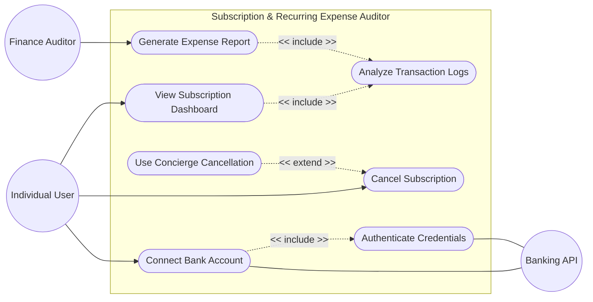

# Lab 1: Requirements Engineering & UML Use-Case Modelling

**Problem Statement #32 | Retail, E-Commerce & Finance**
*Personal Subscription & Recurring Expense Auditor*

## 1. Complete Requirements Table

### Functional Requirements

| ID | Type | Description | Priority | Acceptance Criteria | Rationale |
|---|---|---|---|---|---|
| **FR-001** | Core Feature | The system shall analyze transaction logs to identify recurring billing patterns and project total monthly subscription expenditure. | High | **Pass:** Recurring service identified and renewal date logged. **Fail:** One-time payment misclassified as subscription. | Essential for providing users an accurate overview of their recurring financial commitments. |
| **FR-002** | Integration | The system shall allow users to connect their bank accounts utilizing secure read-only API integrations (e.g., Plaid) to import transaction history automatically. | High | **Pass:** Accounts sync successfully, and transactions populate the app. **Fail:** The connection fails, or the app requests write-access to the bank. | Manual entry is too tedious; automation is necessary for a seamless user experience. |
| **FR-003** | Notification | The system shall trigger automated push or email alerts to the user at least 72 hours prior to an identified subscription renewal date. | High | **Pass:** Alert delivered successfully 3 days before renewal. **Fail:** No alert is sent, or alert is sent after the charge occurs. | Fulfills the objective of alerting users ahead of time so they can cancel unwanted subscriptions before being charged. |
| **FR-004** | Core Feature | The system shall provide an actionable step-by-step cancellation guide or a direct link to the cancellation portal for identified subscriptions. | Medium | **Pass:** A valid guide/link is provided upon clicking a subscription. **Fail:** No actionable cancellation information is available for known providers. | Delivers on the value proposition of "one-click cancellation guides" to save user time. |
| **FR-005** | Reporting | The system shall allow the Finance Auditor to export anonymized, aggregated monthly subscription burn-rate reports in CSV and PDF formats. | Low | **Pass:** Report downloads successfully and contains no PII (Personally Identifiable Information). **Fail:** Report contains cleartext user credentials or fails to generate. | Necessary for auditors to assess macroscopic expense trends across the user base without compromising privacy. |

### Non-Functional Requirements

| ID | Type | Description | Priority | Acceptance Criteria | Rationale |
|---|---|---|---|---|---|
| **NFR-001** | Security & Compliance | Financial transaction imports (CSV/OFX/API) must parse securely without storing raw banking credentials in cleartext anywhere in the system. | High | **Pass:** Penetration and benchmarking tests confirm target security standards; databases show only tokenized access keys. **Fail:** Passwords/credentials found in application logs or database. | Critical for user trust and maintaining financial compliance (e.g., PCI-DSS / SOC2 standards). |
| **NFR-002** | Performance | The system's main dashboard must calculate and render the user's monthly burn rate within 2.0 seconds for transaction logs containing up to 10,000 records. | Medium | **Pass:** Dashboard load time is under 2.0 seconds under simulated load. **Fail:** Application times out or takes longer than 2 seconds to render insights. | Ensures a responsive, modern user experience, preventing user drop-off due to slow load times. |

---

## 2. UML Use-Case Diagram

*(Below is the Mermaid flowchart representation of the Use-Case Diagram. GitHub natively supports rendering this diagram.)*

> **Note on Use-Case Diagram Elements:**
> - **Actors:** Individual User (Primary), Finance Auditor (Secondary), Banking API (External System).
> - **Primary Use Cases:** Connect Bank Account, View Dashboard, Cancel Subscription, Generate Report.
> - **«include»:** *View Subscription Dashboard* requires *Analyze Transaction Logs* to function. *Connect Bank Account* requires *Authenticate Credentials*.
> - **«extend»:** *Use Concierge Cancellation* is an optional extension of the base *Cancel Subscription* use case, allowing users to have the app handle the cancellation process for them.

---

## 3. Use-Case Flow Specification

### **Use Case Name:** Cancel Subscription
**Primary Actor:** Individual User  
**Goal in Context:** To successfully terminate an unwanted recurring subscription identified by the application to reduce monthly expenditure.  

**Preconditions:**
1. The user has successfully authenticated into the application.
2. The user has linked at least one active bank account.
3. The system has analyzed the transaction logs and successfully identified at least one active recurring subscription.

**Postconditions:**
1. The user is provided with actionable steps to cancel the service, **OR** a cancellation request is automatically dispatched on their behalf.
2. The system updates the subscription status to "Pending Cancellation" or "Cancelled".
3. The system recalculates the user's projected monthly burn rate reflecting the removed expense.

#### **Main Success Scenario (Standard Flow):**
1. The user logs into the application and navigates to the **Subscription Dashboard**.
2. The user scrolls through the identified recurring expenses and clicks on a specific subscription they wish to terminate (e.g., "Netflix").
3. The system displays detailed information for that subscription, including the monthly cost, the next expected renewal date, and a **"Cancel Service"** button.
4. The user clicks the **"Cancel Service"** button.
5. The system fetches and displays a step-by-step cancellation guide specific to that provider, along with a direct hyperlink to the provider's official cancellation portal.
6. The user clicks the hyperlink, completes the cancellation process on the provider's external website, and returns to the application.
7. The user clicks a confirmation button stating "I have cancelled this service".
8. The system updates the subscription's status to "Cancelled" and immediately recalculates the projected monthly burn rate.

#### **Alternate Flow (Extension: Concierge Cancellation):**
*This alternate flow extends Step 4 of the Main Success Scenario.*

**4a.** Instead of clicking the standard link to do it manually, the user opts for the premium **"Concierge Cancellation"** feature (if the provider supports it).  
**4a1.** The system prompts the user to provide digital authorization, allowing the application to act as an agent on their behalf.  
**4a2.** The user accepts the terms and clicks "Authorize".  
**4a3.** The system initiates an automated cancellation workflow (via API payload, automated email, or support ticket) directly to the service provider.  
**4a4.** The system sets the subscription status to "Pending Concierge Action".  
**4a5.** The system notifies the user that the request is in progress and returns them to the dashboard. Once the provider confirms the cancellation asynchronously, the system automatically fulfills Step 8 of the Main Success Scenario. 
